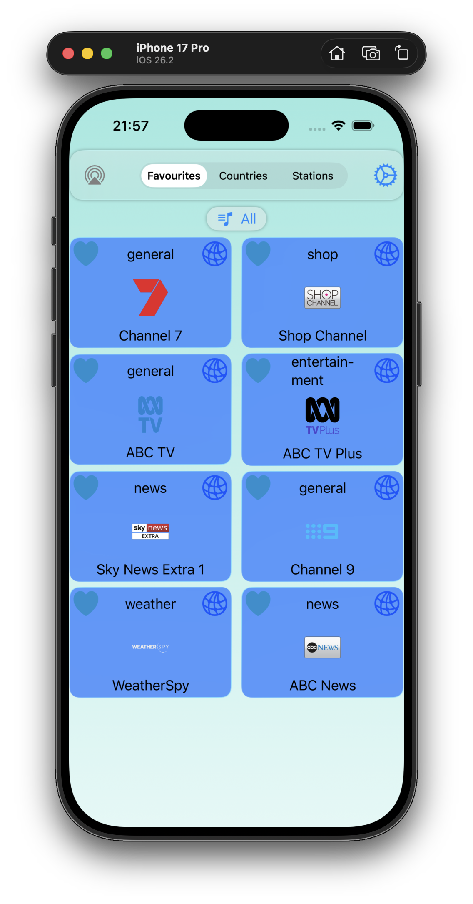
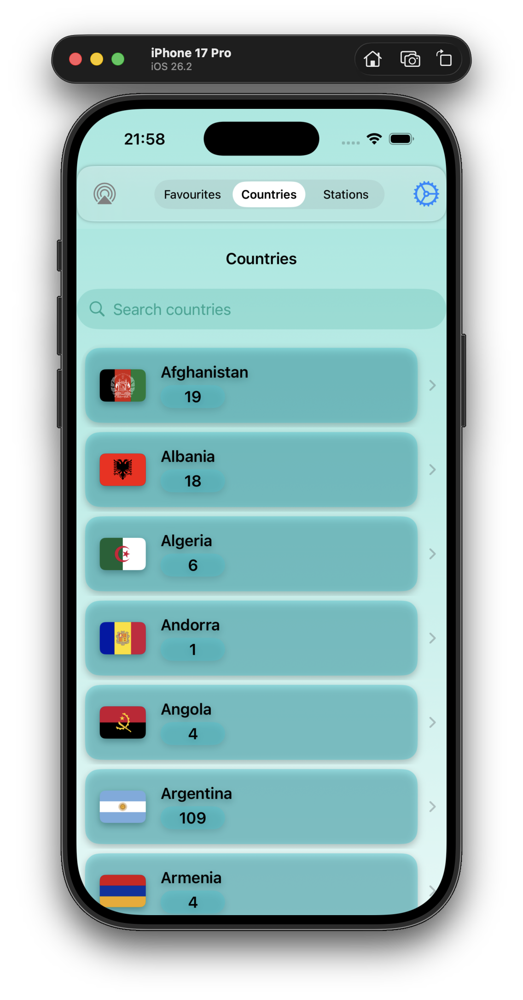

# TvViewer

**TvViewer** lets you display TV stations from the [IPTV](https://github.com/iptv-org/iptv/tree/master) project, a "Collection of publicly available IPTV (Internet Protocol television) channels from all over the world".

  
   
   

## Usage

Tap on the station you want to see, and it will appear as a popup video display.

Search for the country you desire, then tap on the **heart** icon to 
make the station **Favourite**. That TV station will appear in the **Favourites** list.
Tap the **heart** icon again to remove the station from the **Favourites** list.

Similarly, when you search for particular **Stations**.

Tap on the **globe** icon of a TV station to bring its internet home page, if it has one.

## Note

This project uses SwiftUI and SwiftData to store the downloaded data obtained from the [IPTV API](https://github.com/iptv-org/api).

Currently setup for iOS-26, but can easily work on older iOS (remove the .glassEffect) or MacOS with simple changes.

## References

### The TV stations

-    [IPTV](https://github.com/iptv-org/iptv/tree/master) 
-    [IPTV API](https://github.com/iptv-org/api)
